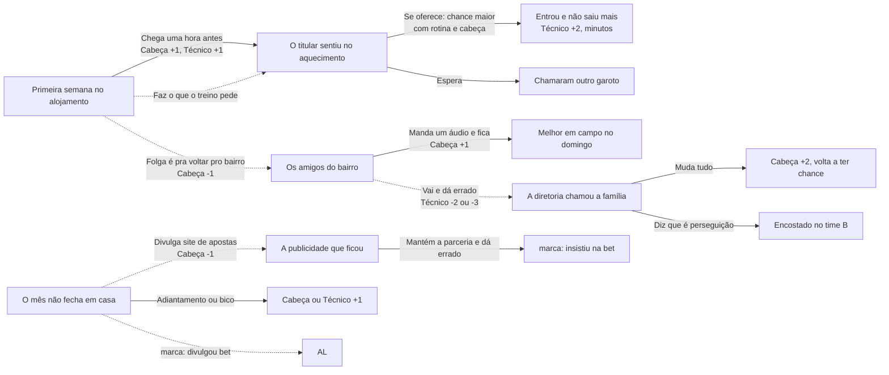
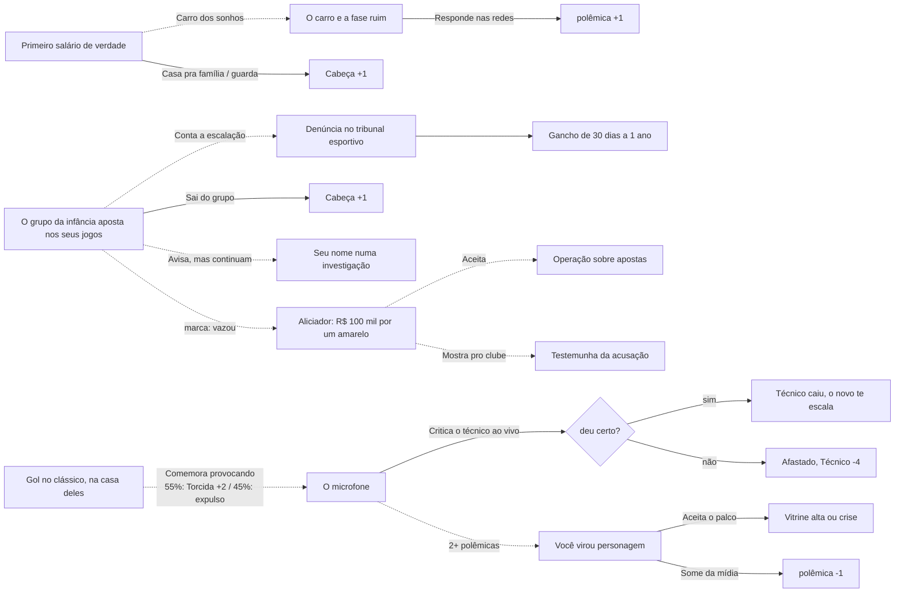
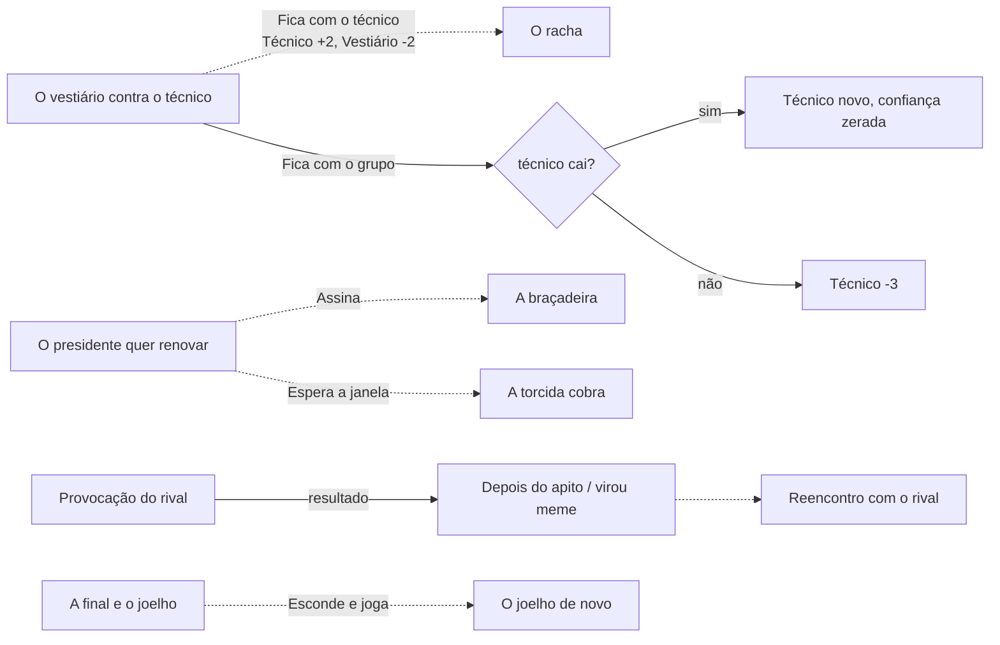
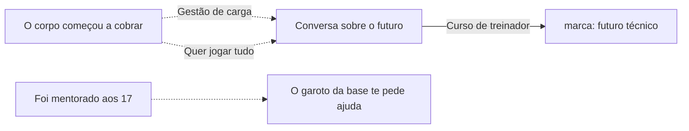

# Prata da Casa: mapa das escolhas

A carreira é dividida em quatro fases. Cada fase tem as suas perguntas. Uma escolha mexe nos medidores na hora e pode marcar o jogador, e essa marca faz outra pergunta aparecer mais tarde: no mesmo ano (seta cheia) ou num ano seguinte (seta tracejada).
Nenhuma situação se repete na mesma carreira. O foco da pré-temporada é a exceção: ele é a escolha de treino de todo ano.

## Medidores (de -5 a +5)

| Medidor | O que muda na temporada |
|---|---|
| **Técnico** (confiança do treinador) | minutos em campo (o que mais pesa). Zera quando você troca de clube |
| **Cabeça** (disciplina fora de campo) | evolução e nota; negativa aumenta o risco de lesão |
| **Torcida** | nota e vitrine pro mercado |
| **Vestiário** | minutos e evolução (cai pela metade ao trocar de clube) |
| **Imprensa** | vitrine pro mercado |

A projeção do ano (jogos, gols, nota, OVR, vitrine) já conta esses medidores. Por isso cada escolha mexe nos números na hora.

## Fase 1 · Base (16 a 19 anos)

Pouco minuto e pouco dinheiro. Treino e cabeça fora de campo decidem quem sobe.

Perguntas soltas da base: treinar com o profissional ou ser titular no sub-20, terminar a escola à noite, celular no alojamento, empresário na porta do CT, estreia, convocação sub-20, o capitão que se oferece pra ser mentor.

## Fase 2 · Afirmação (20 a 24)

O primeiro dinheiro, as redes e as tentações. Polêmica pode render ou afundar.

Quem mexeu com aposta (publicidade, escalação, parceria mantida) tem mais chance de ser procurado pelo aliciador.

## Fase 3 · Auge (25 a 30)

Liderança, vestiário e decisões grandes.

## Fase 4 · Veterano (31+)

O corpo cobra. Hora de pensar no legado.

## Como uma temporada escolhe as perguntas

1. O foco da pré-temporada entra todo ano.
2. Entram as consequências que venceram (no máximo duas).
3. Se a fase acabou de começar, entra o arco que abre a fase: a rotina aos 16, o primeiro contrato aos 19–21 e o corpo aos 31.
4. Senão, pode começar um arco novo da fase. Arcos que combinam com as suas marcas pesam mais: quem mexeu com aposta atrai o aliciador.
5. Situações soltas da fase completam o ano. Nenhuma repete na mesma carreira.

No automático ("Simular o resto"), a consequência que venceu resolve sozinha pela primeira opção. Arco novo não começa no automático.
