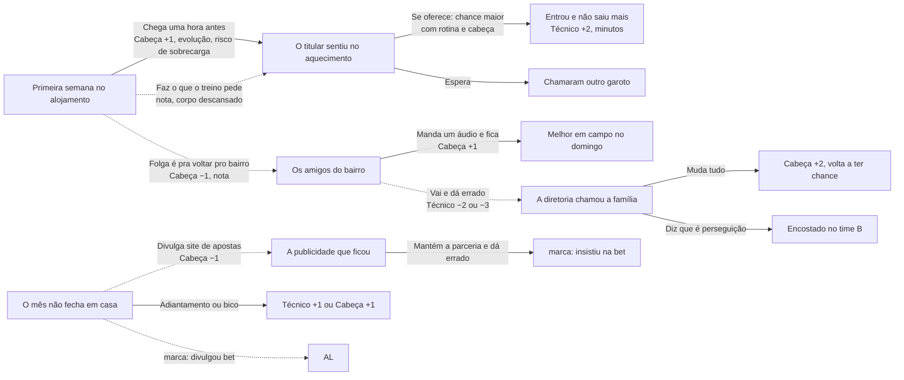
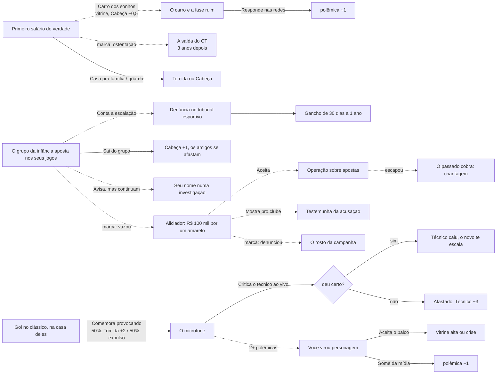
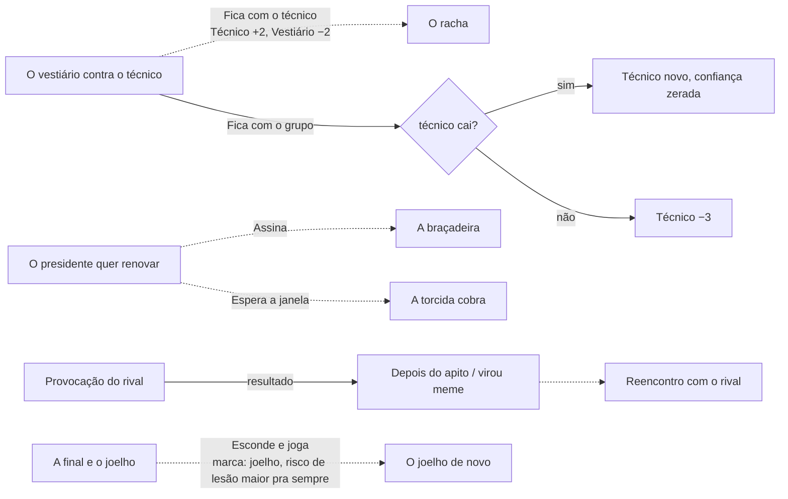
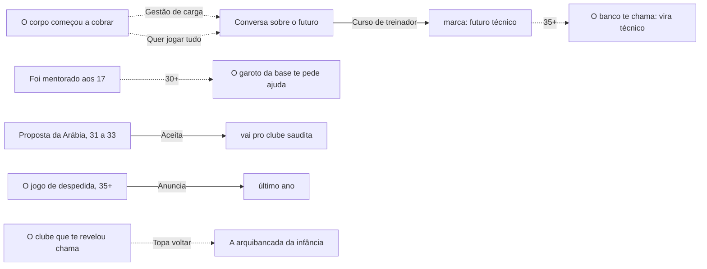

# Prata da Casa: mapa das escolhas

A carreira é dividida em quatro fases, e cada fase tem as suas perguntas. Uma escolha mexe nos medidores na hora e pode marcar o jogador. Essa marca faz outra pergunta aparecer mais tarde: no mesmo ano (seta cheia) ou num ano seguinte (seta tracejada).

Nenhuma situação se repete na mesma carreira. A exceção é o foco da pré-temporada, que é a escolha de treino de todo ano. Situações do mesmo **tema** também não se repetem, contando tanto as soltas (`carreira.js`) quanto os arcos (`historia.js`). Os temas são:

- jogar machucado;
- pênalti;
- apostas;
- rival e clássico;
- microfone;
- crise;
- mentor;
- empresário;
- adaptação no exterior;
- carga física;
- capitão.

Opção sem roleta mostra os dois lados na tela, por exemplo "+ nota, evolução" e "− vestiário". Opção com roleta mostra a porcentagem real de dar certo.

## Medidores (de −5 a +5)

| Medidor | O que muda na temporada |
|---|---|
| **Técnico** (confiança do treinador) | Minutos em campo (é o que mais pesa). Zera quando você troca de clube, inclusive na ida e na volta de empréstimo. |
| **Cabeça** (disciplina fora de campo) | Evolução e nota. Negativa aumenta o risco de lesão. |
| **Torcida** | Nota, vitrine pro mercado e um pouco de evolução. |
| **Vestiário** | Minutos e evolução. Cai pela metade ao trocar de clube. |
| **Imprensa** | Vitrine pro mercado. |

Os medidores decaem 20% por temporada, uma vez só, na hora de jogar o ano. O arredondamento é em direção ao zero: o que você fez há cinco temporadas pesa pouco hoje.

Ao lado das barras, o painel mostra o que a reputação vale no ano, por exemplo: "+5% de minutos, nota +0,06, vitrine +1,2".

A projeção do ano (jogos, gols, nota, OVR, vitrine) já conta os medidores, e cada escolha mexe nos números na hora. Recalcular a projeção não mexe na reputação.

## Evolução e potencial

O potencial é sorteado escondido:

| Faixa de potencial | Chance |
|---|---|
| 76–84 | 58% |
| 85–89 | 24,5% |
| 90–92 | 12% |
| 93–95 | 4% |
| 97–99 | 1,5% |

O sorteio é a promessa; o trabalho decide quanto dela se cumpre, até os 24 anos. Todo ano o potencial escorrega um pouco se nada compensar: quem joga no automático termina uns 2 pontos abaixo do sorteado, quem se cuida chega a +2.

- **O que soma:** evolução acima do normal no ano (foco no atributo que mais pesa na posição, treino extra, cabeça, ambiente, contrato longo), até +2 sobre o sorteado.
- **O que tira:** a noite, a lesão mal curada, o banco e o ano sem cuidado, até −6.
- **O que não conta:** a adaptação do primeiro ano num clube novo.

O salto é dos 16 aos 24 (goleiro, aos 26): aos 24 o jogador já fez 94% do caminho até o potencial, e o resto vem devagar até o pico. Cada atributo fica no máximo 8 acima do OVR ao subir, e na queda o que passa de OVR + 6 cai primeiro: a carta segue equilibrada até o fim.

Metas do auge (bateria, 27/09): jogando sério, 94+ em ~6–8%, 91–93 em ~13% e 88–90 em ~17%; com escolhas aleatórias, 94+ em ~5%.

## Fase 1 · Base (16 a 19 anos)

Pouco minuto e pouco dinheiro. Treino e cabeça fora de campo decidem quem sobe. A **estreia no profissional** entra sempre no primeiro ano (modo completo).

```mermaid
flowchart LR
  A[Primeira semana no alojamento] -->|Chega uma hora antes<br/>Cabeça +1, evolução, risco de sobrecarga| OP[O titular sentiu no aquecimento]
  A -.->|Faz o que o treino pede<br/>nota, corpo descansado| OP
  A -.->|Folga é pra voltar pro bairro<br/>Cabeça −1, nota| B[Os amigos do bairro]
  OP -->|Se oferece: chance maior<br/>com rotina e cabeça| OK1[Entrou e não saiu mais<br/>Técnico +2, minutos]
  OP -->|Espera| X1[Chamaram outro garoto]
  B -->|Manda um áudio e fica<br/>Cabeça +1| OK2[Melhor em campo no domingo]
  B -.->|Vai e dá errado<br/>Técnico −2 ou −3| D[A diretoria chamou a família]
  D -->|Muda tudo| OK3[Cabeça +2, volta a ter chance]
  D -->|Diz que é perseguição| X2[Encostado no time B]

  M[O mês não fecha em casa] -.->|Divulga site de apostas<br/>Cabeça −1| P[A publicidade que ficou]
  M -->|Adiantamento ou bico| OK4[Técnico +1 ou Cabeça +1]
  P -->|Mantém a parceria e dá errado| BI[marca: insistiu na bet]
  M -.->|marca: divulgou bet| AL
```

Perguntas soltas da base:

- treinar com o profissional ou ser titular no sub-20;
- terminar a escola à noite;
- celular no alojamento;
- empresário na porta do CT;
- estreia;
- convocação sub-20;
- o capitão que se oferece pra ser mentor.

## Fase 2 · Afirmação (20 a 24)

O primeiro dinheiro, as redes e as tentações. Polêmica pode render ou afundar.

```mermaid
flowchart LR
  C[Primeiro salário de verdade] -.->|Carro dos sonhos<br/>vitrine, Cabeça −0,5| G[O carro e a fase ruim]
  C -.->|marca: ostentação| AS[A saída do CT<br/>3 anos depois]
  C -->|Casa pra família / guarda| OKc[Torcida ou Cabeça]
  G -->|Responde nas redes| POL1[polêmica +1]

  GR[O grupo da infância aposta nos seus jogos] -.->|Conta a escalação| STJD[Denúncia no tribunal esportivo]
  GR -->|Sai do grupo| OKg[Cabeça +1, os amigos se afastam]
  GR -.->|Avisa, mas continuam| INV[Seu nome numa investigação]
  STJD --> GAN[Gancho de 30 dias a 1 ano]
  GR -.->|marca: vazou| AL

  AL[Aliciador: R$ 100 mil por um amarelo] -.->|Aceita| OPR[Operação sobre apostas]
  OPR -.->|escapou| CH[O passado cobra: chantagem]
  AL -.->|Mostra pro clube| TEST[Testemunha da acusação]
  AL -.->|marca: denunciou| CAMP[O rosto da campanha]

  PC[Gol no clássico, na casa deles] -.->|Comemora provocando<br/>50%: Torcida +2 / 50%: expulso| MIC[O microfone]
  MIC -->|Critica o técnico ao vivo| CRIT{deu certo?}
  CRIT -->|sim| T1[Técnico caiu, o novo te escala]
  CRIT -->|não| T2[Afastado, Técnico −3]
  MIC -.->|2+ polêmicas| PER[Você virou personagem]
  PER -->|Aceita o palco| PAL[Vitrine alta ou crise]
  PER -->|Some da mídia| CALM[polêmica −1]
```

**Apostas.** Nem todo jogador cruza com esse mundo: isso é sorteado uma vez por carreira (36%), e só entra um arco de apostas por carreira. A exceção é o aliciador, que ainda procura quem divulgou bet ou vazou escalação.

**O rival.** Quem provocou o rival (respondeu ou tirou onda) pode vê-lo chegar ao próprio clube dois anos depois ("O rival no seu vestiário").

## Fase 3 · Auge (25 a 30)

Liderança, vestiário e decisões grandes.

```mermaid
flowchart LR
  CR[O vestiário contra o técnico] -.->|Fica com o técnico<br/>Técnico +2, Vestiário −2| RA[O racha]
  CR -->|Fica com o grupo| G2{técnico cai?}
  G2 -->|sim| N[Técnico novo, confiança zerada]
  G2 -->|não| T3[Técnico −3]
  REN[O presidente quer renovar] -.->|Assina| BR[A braçadeira]
  REN -.->|Espera a janela| COB[A torcida cobra]
  RIV[Provocação do rival] -->|resultado| DEP[Depois do apito / virou meme]
  DEP -.-> REE[Reencontro com o rival]
  J[A final e o joelho] -.->|Esconde e joga<br/>marca: joelho, risco de lesão maior pra sempre| J2[O joelho de novo]
```

**O ídolo da divisão.** Vale pra quem tem entre 20 e 28 anos, joga num clube da Série B/C/D e tem OVR pelo menos 3 acima do nível do clube. Ficar embaixo agora é uma escolha, não um atalho:

- **"Renova e vira o ídolo da cidade":** Torcida +2, contrato de 3 anos sem propostas, vitrine −2 e menos potencial. Dois anos depois vem "A cidade é sua": ficar pra sempre (marca fiel) ou tentar a última subida.
- **"Pede pra ser vendido":** Torcida −2 e vitrine. Na janela, o clube negocia com alguém um degrau acima.

Na Série B, C e D, os prêmios da liga têm limiar mais alto, porque a nota sai inflada contra time fraco. A seleção quase não olha pra lá, e a Bola de Ouro não existe.

**No exterior.** "O primeiro inverno" (choque cultural) aparece no primeiro ano fora; Portugal não conta. As opções são:

- colar nos brasileiros: nota, mas vira panelinha;
- se trancar no CT: evolução, mas um ano solitário;
- mergulhar no idioma: roleta.

Depois vêm "Um clube brasileiro quer te repatriar" ou "O passaporte" (naturalização, pra quem nunca foi convocado).

**A seleção (ano de Copa).** "A lista da Copa e a coxa" tem duas saídas:

- **Esconde e vai:** roleta. Dando errado, você é cortado da Copa.
- **Avisa o médico:** fica fora da Copa, e o clube recebe você inteiro.

Quem jogou escondido pode ganhar depois "A braçadeira da seleção".

## Fase 4 · Veterano (31+)

O corpo cobra. Hora de pensar no legado.

```mermaid
flowchart LR
  CO[O corpo começou a cobrar] -.->|Gestão de carga| LE[Conversa sobre o futuro]
  CO -.->|Quer jogar tudo| LE
  LE -->|Curso de treinador| FT[marca: futuro técnico]
  FT -.->|35+| INT[O banco te chama: vira técnico]
  MEN[Foi mentorado aos 17] -.->|30+| AP[O garoto da base te pede ajuda]
  AR[Proposta da Arábia, 31 a 33] -->|Aceita| AS2[vai pro clube saudita]
  DES[O jogo de despedida, 35+] -->|Anuncia| FIM[último ano]
  FORM[O clube que te revelou chama] -.->|Topa voltar| CASA[A arquibancada da infância]
```

"O preparador físico tem um plano" (a rotina de recuperação) aparece aos 28–30, antes do arco "O corpo", que abre aos 31.

## Consequência que ficou pra trás

Se você trocou de clube antes de uma consequência chegar, a temporada avisa "ficou pra trás" e diz em uma linha o que não aconteceu. Vale pra:

- o racha;
- a braçadeira;
- a torcida cobra;
- o reencontro;
- a cidade é sua;
- a volta pra casa.

## Como uma temporada escolhe as perguntas

1. O **foco do ano** não é uma decisão: é um chip no topo da temporada. São 3 opções (o que mais pesa na posição, o seu ponto forte e mais uma), e dá pra trocar até a metade do ano. A dica muda com a fase, e o atributo que mais pesa faz o OVR crescer mais.
2. Entram as consequências que venceram e as cenas de marca (o rival companheiro, o banco de técnico): até duas no completo e uma no rápido. A que não coube espera o ano seguinte.
3. Se a fase acabou de começar, entra um arco que abre a fase. Na base, sorteado entre a rotina, "Longe de casa", "O treino do profissional" e "O técnico do sub-17". Depois vêm o primeiro contrato (salário conforme a divisão) e o corpo aos 31.
4. O arco de situação (primeiro ano no exterior, ano de Copa, despedida) entra quando a situação chega.
5. Senão, pode começar um arco novo da fase, sem repetir tema. Arcos que combinam com as suas marcas pesam mais: quem mexeu com aposta atrai o aliciador.
6. Completam o ano os **lances de jogo** (a decisão muda o placar e a força do time no ano) e as situações soltas da fase. Nenhuma se repete, e o tema também não. Pênalti decisivo e pênalti no fim do jogo, por exemplo, são o mesmo tema.
   - **Completo:** 3 decisões por ano (história + lance + situação); o lance entra em 70% dos anos.
   - **Rápido:** exatamente 1 escolha por ano: a história, se houver; senão, um lance (45%) ou uma situação solta.
   - A estreia no profissional vem na frente no primeiro ano do completo.

## Contratos

Toda assinatura vem com prazo. O cartão da proposta mostra só até quando: "Vai até 2030", ou "Vai até 2030 · chega de graça" pra quem está livre. O botão é "Aceita" (na peneira, "Assina").

**Duração**

| idade | contrato |
|---|---|
| até 25 anos | 4 anos |
| 26 a 29 | 3 anos |
| 30 a 34 | 2 anos |
| 35+ | 1 ano |

- Clube da Série A ou do exterior dá +1 ano até os 29.
- A elite europeia contrata por no mínimo 3 anos até os 32.
- A base assina por 3.

**O seu clube na janela.** Os botões mudam com o contrato:

- **Com contrato (2+ anos):** "Segue no clube (contrato até 2031)". As propostas chegam, mas quem decide é o clube: ele só libera um passo claro acima, mais fácil pra quem jogou bem, e a elite europeia não vende pra ninguém do mesmo nível. As recusadas aparecem, e dá pra "Pede pra ser vendido" (Técnico, Torcida e Vestiário −1; o clube pode segurar, e quase sempre segura quem acabou de chegar).
- **Último ano:** o clube vende mais fácil (o passe custa metade). As opções são:
  - "Renova por mais 1 ano": porta aberta, sem aumento;
  - "Renova por mais 3 anos", que vem com aumento e mais minutos, ou bônus por gol, ou "Renova por mais 4 anos, como ídolo". Só pra quem jogou bem, e encurta depois dos 30;
  - "Deixa o contrato acabar (sai de graça no fim)".
- **Livre:** "Renova por 1 ano" (e o contrato longo, pra quem jogou bem), ou aceita outra proposta. Nada é barrado, e o mercado olha mais (menos pro veterano de 32+).
- **Simular o resto:** a janela automática segue as mesmas regras, e quem fica livre renova pelo contrato padrão.

Toda opção de renovação mostra os dois lados em uma linha (+ / −).

**Exceções**

- Empréstimo não mexe no contrato: ele segue com o clube dono.
- A palavra dada (clube formador) e o pedido aceito pela diretoria ("O ídolo da divisão", repatriação) passam direto.
- A Arábia paga a multa.

## Modos

- **Completo:** 3 decisões por temporada, mais o foco do ano.
- **Rápido:** 1 escolha por temporada, mais o foco do ano.

Nos dois modos a janela de transferências é sua: escolher entre as propostas liberadas, pedir vaga de titular, pedir pra ser vendido, renovar ou deixar o contrato acabar. Renovação e transferência aparecem no resumo do ano seguinte, num bloco "Janela de transferências".

## No automático ("Simular o resto")

A consequência que venceu resolve sozinha pela **opção mais prudente**, não pela primeira. A ordem de preferência é:

1. a opção certa, sem roleta;
2. na roleta, a de maior chance;
3. no empate, a que não abre outra consequência.

Quem clica em simular não escolheu arriscar. Arco novo não começa no automático. O foco do ano é escolhido pelo preparador: o atributo que mais pesa na posição.

Quando o jogador deu a palavra a um clube, a proposta desse clube é aceita no automático. Vale pra três casos: clube formador, pedido pra ser vendido e repatriação.

## O final

A tela de aposentadoria dá um nome à carreira, tirado dos números. A ordem de prioridade é:

1. **Carreira manchada:** gancho longo ou chantagem que vazou.
2. **Lenda:** Bola de Ouro, ou auge 91+ com muitos títulos e prêmios.
3. **Ídolo da Série X:** 7+ anos no mesmo clube de divisão de baixo.
4. **Rodou o mundo:** 4+ países.
5. **Estrela na Europa:** 5+ temporadas lá.
6. **Camisa da seleção:** 50+ jogos ou título.
7. **Ídolo do clube:** 8+ anos no mesmo clube.
8. **Andarilho:** 7+ clubes.
9. **A promessa que não vingou.**
10. **Operário da Série A.**
11. **Craque da Série A.**
12. **Guerreiro do acesso.**
13. **Carreira de respeito.**

Embaixo vem o "depois das chuteiras": técnico do clube, curso de treinador feito ou jogo de despedida.
